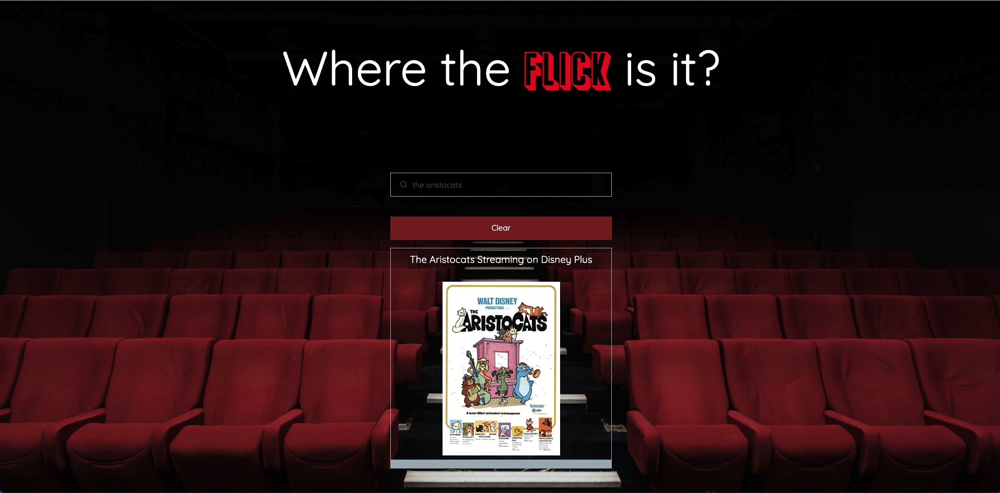

# Where the Flick is it? 

The "Where the Flick is it?" app is a sleek, clean interface that provides a way for users to quickly search their favorite movies to see which platforms they are currently streaming on.  
Users can interact with the search bar which will immediately show results as they are typing.  
They can also see their recent searches displayed on the UI along with a cool movie poster.   

## Architecture
This app is built out with [Pico CSS](https://picocss.com/docs/) for the frontend with a responsive design so that it can be used on any screen size.  
JavaScript is used for the backend which handles the users input to call two different APIS to retrieve movie data and save their recent searches in localStorage.  
Here are links to the two APIs being utilized in this app:    
1. [TMDB](https://www.themoviedb.org/documentation/api)
2. [Movie Database Alternative](https://rapidapi.com/rapidapi/api/movie-database-alternative/details)  

## See the app!
Click here to find your flicks: [Where the Flick is it?](https://ashtreid.github.io/where-the-flick)

